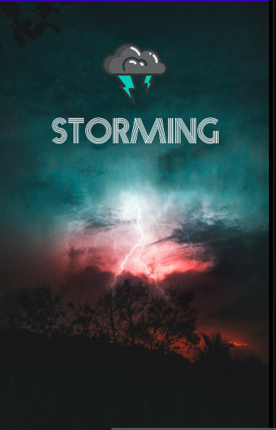
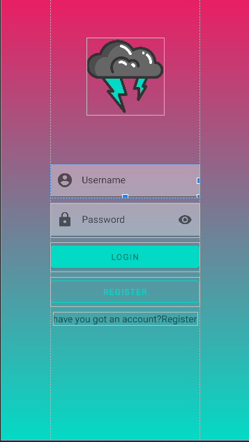

# First
## Rodrigo Zafra Pérez

### Pasos a seguir para desarrollar la práctica
#### 1. Creación de la ventana de splash:
  En el activity_splash lo que vamos a tener es una imágen de fondo que va a ocupar toda la pantalla, una imágen del logo de la aplicación que en este caso es una nube
  con unos rayos de tormenta y debajo del logo el nombre de la aplicación que es **STORMING**.
  Al iniciar la aplicación tenemos una pequeña animación en el logo para que parpadee dando una sensación de tormenta y el fondo también es una tormenta para que todo
  sea esteticamente igual y tenga la misma temática.
  
  
#### 2. Creación de la ventana de login:
  En el activity_login nos volvemos a encontrar con el icono del logo en la parte superior. También tenemos dos **TextInputLayaout** uno para el nombre de usuario y otro
  para la password. Justo debajo nos encontramos con dos botones uno para hacer el login y entrar a la aplicación y otro para registrarse en el caso de que no lo estes.
  
  
#### 3. Creación de la ventana de registro:
  El activity_signup es practicamente lo mismo que login pero tiene un campo para repetir la contraseña y otro para introducir el email y al final un botón para
  registrarse.
  
  
