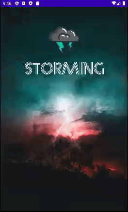
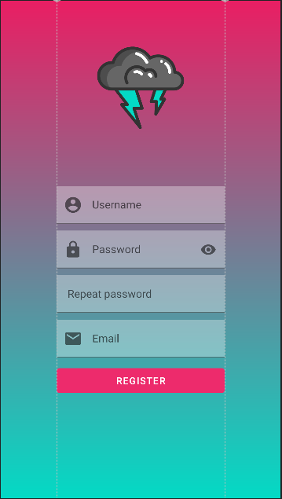

# First
## Rodrigo Zafra Pérez

### Pasos a seguir para desarrollar la práctica
#### 1. Creación de la ventana de splash:
  En el activity_splash lo que vamos a tener es una imágen de fondo que va a ocupar toda la pantalla, una imágen del logo de la aplicación que en este caso es una nube
  con unos rayos de tormenta y debajo del logo el nombre de la aplicación que es **STORMING**. La fuente de la pantalla de splash es prisma.
  Al iniciar la aplicación tenemos una pequeña animación en el logo para que parpadee dando una sensación de tormenta y el fondo también es una tormenta para que todo
  sea esteticamente igual y tenga la misma temática. Para crear la animación he creado una carpeta en res llamada anim y dentro dos animated resource file con el código
  necesario para crear la . La animación se puede observar en el gif siguiente:
  
  
#### 2. Creación de la ventana de login:
  En el activity_login nos volvemos a encontrar con el icono del logo en la parte superior. También tenemos dos **TextInputLayaout** uno para el nombre de usuario y otro
  para la password. Justo debajo nos encontramos con dos botones uno para hacer el login y entrar a la aplicación y otro para registrarse en el caso de que no lo estes.
  Está ventana tiene una  para que el logo baje de la parte superior con una pequeña rotación. De fondo de la ventana
  tenemos un  desde un azul cyan hasta un fucsia y una imágen de una chica de fondo.
  
  
#### 3. Creación de la ventana de registro:
  El activity_signup es practicamente lo mismo que login pero tiene un campo para repetir la contraseña y otro para introducir el email y al final un botón para
  registrarse. Al pulsar el botón registrarse te lleva de nuevo a la ventana de login para ingresar en tu cuenta. Está ventana no contiene ningún efecto.
  
  
#### 4. Creación del main:
  El activity_main contiene una barra superior en la que aparece el nombre de la aplicación y un menú con una lupa para buscar, un corazón para dar me gusta y un submenu
  que te permite salir de tu cuenta o elegir otras cuentas que tengas. Al pulsar en la lupa aparece un mensaje que es un Toast que dice infecting, y al pulsar el corazón
  aparece un mensaje que dice me gusta. Cuando pulsamos el botón de sign out del submenu nos aparece un alert dialog que no dice si queremos salir o no.
  Como centro de la ventana tenemos una librería de imágenes y un swipeRefreshLayout para ir cambiando de imágen. Si dejamos pulsada la imágen nos sale un menú que nos 
  dice si queremos copiarla o descargarla. En el siguiente gif podemos observar todas las animaciones de la ventana.
  
    
